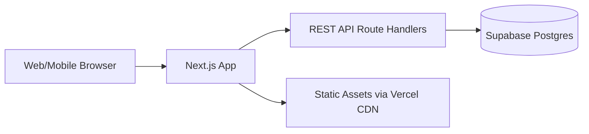

# 在线日历设计文档

## 1. 文档目标

本文档描述在线日历 MVP 的目标、架构、接口、部署与验证方式，作为当前实现与后续迭代的参考。

- 用户可以标记某天做了什么事情
- 对已标记的日子可编辑和删除
- 同一天可按不同活动分别标记与删除
- 按月查看日历并显示已标记状态
- 按指定日期搜索并查看详情
- 支持预设活动快捷标定
- 移动端友好
- 提供 REST API 供第三方集成
- 提供简单统计能力（例如最近 30 天该活动次数，以及过去一年的月度分布）
- 使用免费工具和免费托管方案

当前版本默认单用户、轻量访问场景，不纳入复杂权限与高并发优化。

## 2. 推荐技术栈

- 前后端一体框架：Next.js 15（App Router）
- 语言：TypeScript
- UI：Tailwind CSS + shadcn/ui（可选）
- 日期处理：dayjs
- 数据库：Supabase Postgres（免费层）
- ORM：Drizzle ORM（可选）
- API：Next.js Route Handlers（REST 风格）
- 部署：Vercel（免费层）

### 2.2 选型理由

- Next.js 同时覆盖页面与 API，降低项目拆分成本
- Supabase 提供免费的托管数据库与控制台
- Vercel 与 Next.js 原生适配，部署链路最短
- TypeScript 便于维护与重构

## 3. 典型目录结构

当前仓库已按以下结构组织：

```text
calendar-proj/
├─ docs/
│  └─ online-calendar-design.md
├─ public/
│  └─ icons/
├─ scripts/
├─ src/
│  ├─ app/
│  │  ├─ api/
│  │  │  ├─ activities/
│  │  │  ├─ entries/
│  │  │  └─ stats/
│  │  ├─ calendar/
│  │  ├─ search/
│  │  └─ stats/
│  ├─ components/
│  ├─ features/
│  │  ├─ activities/
│  │  ├─ calendar/
│  │  └─ stats/
│  ├─ lib/
│  └─ types/
├─ supabase/
│  └─ migrations/
└─ tests/
   └─ api/
```

说明：

- `src/features` 按业务域组织
- `src/app/api` 管理 REST 接口
- `supabase/migrations` 保存数据库迁移
- `tests/api` 覆盖关键逻辑

## 4. 业务模型设计

### 4.1 实体定义

1. 活动模板（Activity）
- 用于预设活动，如“运动/学习/阅读”
- 可被日历记录引用

2. 日历记录（CalendarEntry）
- 代表某天与某活动的标记记录
- 记录标题、备注、关联活动、创建时间

### 4.2 数据库表结构

#### activities

- `id` UUID PK
- `name` VARCHAR(50) NOT NULL
- `color` VARCHAR(20) NOT NULL
- `is_preset` BOOLEAN NOT NULL DEFAULT true
- `created_at` TIMESTAMP NOT NULL DEFAULT now()

#### calendar_entries

- `id` UUID PK
- `entry_date` DATE NOT NULL
- `title` VARCHAR(100) NOT NULL
- `note` TEXT NULL
- `activity_id` UUID NULL REFERENCES activities(id)
- `created_at` TIMESTAMP NOT NULL DEFAULT now()
- `updated_at` TIMESTAMP NOT NULL DEFAULT now()

### 4.3 索引与约束建议

- `calendar_entries(entry_date)` 用于按天查询
- `calendar_entries(activity_id, entry_date)` 用于统计查询
- 允许同一天按不同活动记录多条数据

## 5. SQL 迁移示例

```sql
create extension if not exists pgcrypto;

create table if not exists activities (
  id uuid primary key default gen_random_uuid(),
  name varchar(50) not null,
  color varchar(20) not null,
  is_preset boolean not null default true,
  created_at timestamp not null default now()
);

create table if not exists calendar_entries (
  id uuid primary key default gen_random_uuid(),
  entry_date date not null,
  title varchar(100) not null,
  note text,
  activity_id uuid references activities(id) on delete set null,
  created_at timestamp not null default now(),
  updated_at timestamp not null default now()
);

create index if not exists idx_entries_date on calendar_entries(entry_date);
create index if not exists idx_entries_activity_date on calendar_entries(activity_id, entry_date);

insert into activities(name, color, is_preset) values
('运动', '#22c55e', true),
('学习', '#3b82f6', true),
('阅读', '#f59e0b', true),
('旅行', '#ef4444', true)
on conflict do nothing;
```

## 6. REST API 设计

统一前缀：`/api`

### 6.1 活动相关

1. `GET /api/activities`
- 查询全部活动模板

2. `POST /api/activities`
- 新增活动模板

### 6.2 日历记录相关

1. `POST /api/entries`
- 创建某天活动标记

2. `GET /api/entries?month=2026-06`
- 查询某月全部记录

3. `GET /api/entries/date/2026-06-06`
- 查询某天全部记录

4. `PUT /api/entries/:id`
- 更新记录

5. `DELETE /api/entries/:id`
- 删除记录

### 6.3 统计相关

1. `GET /api/stats?activityId=xxx`
- 描述：默认返回最近 30 天次数，以及过去 12 个月每月次数
- 响应：`{ last30Days, trailingYear, activityId }`

统计口径建议：

- 最近 30 天按真实标记条数统计
- 过去 12 个月按每月真实标记条数统计

## 7. 页面与交互设计

### 7.1 页面清单

1. 月历页 `/calendar`
- 三个月视图，默认当前月居中
- 日期网格展示与星期对齐
- 已标记日期显示颜色圆点
- 点击日期弹出活动切换抽屉

2. 活动管理页 `/activities`
- 新增活动
- 编辑活动
- 删除活动

3. 搜索页 `/search`
- 日期选择器
- 显示当天全部记录

4. 统计页 `/stats`
- 活动筛选
- 最近 30 天统计
- 过去 12 个月月度图表

### 7.2 移动端友好策略

- 底部导航固定可见
- 日期弹层在手机端使用底部抽屉
- 日期格子保持可点击面积
- 优先保证单手可操作

### 7.3 关键交互流程

1. 快捷标定流程
- 用户点击日期
- 弹层列出所有活动
- 对未标记活动执行新增，对已标记活动执行删除

2. 活动管理流程
- 在独立页面新增、编辑、删除活动
- 删除活动时清理关联标记

## 8. 系统架构



### 8.1 分层职责

- UI 层：页面、组件、交互状态
- 应用层：输入校验、业务编排
- 数据层：查询与持久化

## 9. 核心实现细节

### 9.1 日期规范

- API 与数据库统一使用 `YYYY-MM-DD`
- 月查询参数使用 `YYYY-MM`
- 前端只负责展示格式转换

### 9.2 输入校验

建议使用 Zod：

- 校验日期格式和 UUID
- 限制文本长度
- 保证更新接口至少提供一个字段

### 9.3 错误处理

统一返回结构：

```json
{
  "error": {
    "code": "VALIDATION_ERROR",
    "message": "entryDate format is invalid"
  }
}
```

常见状态码：

- `200` 查询成功
- `201` 创建成功
- `400` 参数错误
- `404` 记录不存在
- `500` 服务内部错误

### 9.4 性能与可维护性

- 月视图一次拉取相邻月份数据
- 前端缓存当月结果
- 统计接口依赖 `activity_id` 与 `entry_date` 索引

## 10. 测试方案

### 10.1 API 测试最小集

- 创建记录成功/失败
- 更新记录成功/不存在
- 删除记录成功/不存在
- 月查询跨月边界校验
- 统计接口按月汇总和最近 30 天统计是否正确

### 10.2 手工验收清单

- 移动端日历点击是否顺畅
- 预设活动新增/删除是否生效
- 删除活动后关联标记是否同步清理
- 搜索某日能否正确展示全部记录

## 11. 部署与运维（免费）

### 11.1 部署步骤

1. 在 Supabase 创建数据库项目并执行迁移 SQL
2. 在 Vercel 导入 Git 仓库
3. 配置环境变量：
- `NEXT_PUBLIC_SUPABASE_URL`
- `NEXT_PUBLIC_SUPABASE_ANON_KEY`
- `SUPABASE_SERVICE_ROLE_KEY`（仅服务端使用）
4. 确认构建命令为 `npm run build`，安装命令为 `npm install`
5. 触发首次部署，后续每次推送会自动重新部署

### 11.2 本地预览与排查

1. 执行 `npm install`
2. 启动开发服务器：`npm run dev`
3. 打开 `http://localhost:3000`
4. 如需真机测试，可用电脑局域网 IP 从手机访问开发服务器

### 11.3 监控建议

- 使用 Vercel 日志观察 API 错误
- 使用 Supabase 控制台观察慢查询

## 12. 迭代计划

### 里程碑 M1（2-3 天）

- 月视图 + 标记新增/编辑/删除
- 日期搜索
- 预设活动

### 里程碑 M2（1-2 天）

- 统计页
- API 测试补齐
- 移动端优化

### 里程碑 M3（可选）

- 用户体系（登录/多用户）
- 数据导出（CSV/ICS）
- 日历订阅（iCal）

## 13. 风险与边界

- 当前不重点处理安全与权限，适合 MVP 验证
- 免费层有资源上限，需关注访问量增长
- 跨时区场景需统一时区策略（建议先固定本地时区）

## 14. 开发启动清单

1. 初始化 Next.js + Tailwind + TypeScript
2. 建立数据库表与种子数据
3. 完成 `/api/entries` 与 `/api/activities`
4. 完成月视图页面和记录编辑弹层
5. 增加 `/api/stats` 与统计页
6. 部署到 Vercel 并验收

---

本文档可直接作为实现蓝图。如果后续需要，我可以继续补充：

- OpenAPI 3.1 规范文件
- 前端组件拆分明细（props 与状态流）
- 按接口维度的 TypeScript 类型定义模板
